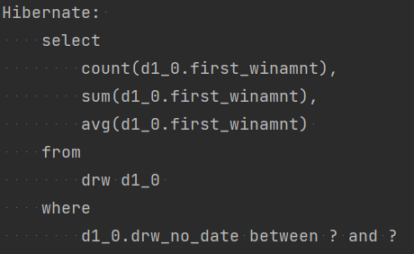
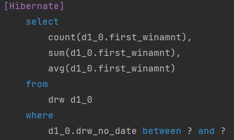
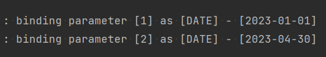
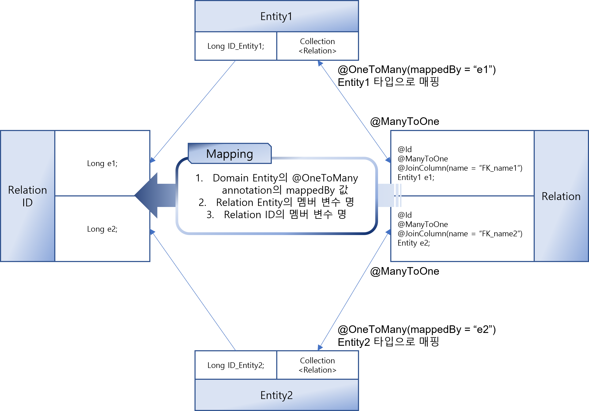
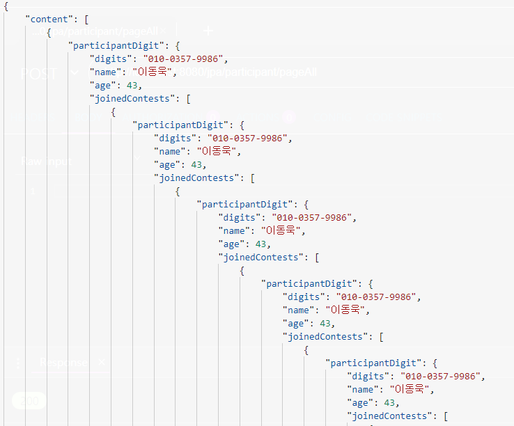
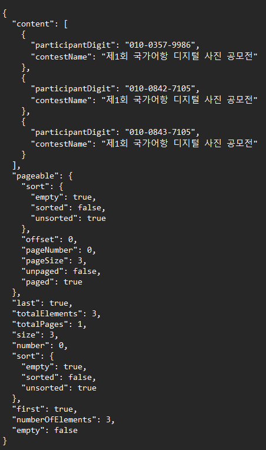
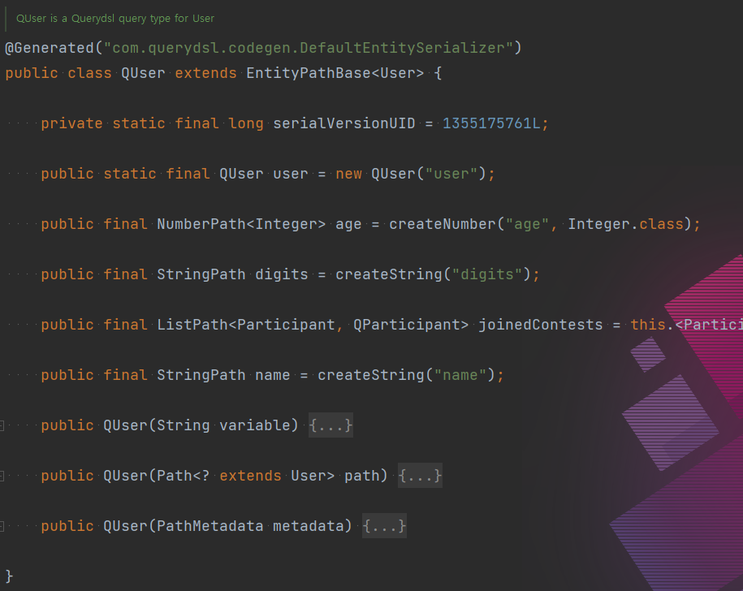
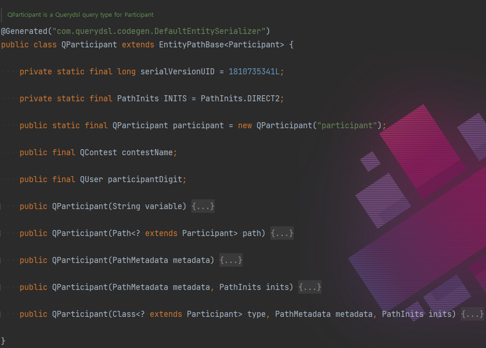
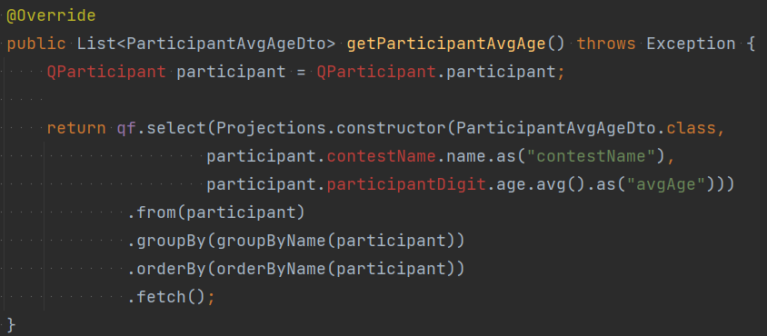

# JPA - QueryDSL
* Java Persistenct API
* Query Domain Specifc Langauage
## Intro
User, Contest, Participant 세 개의 Entity를 이용해
SpringBoot에서 JPA와 QueryDSL 사용
> 웹페이지는 따로 구현하지 않고 Advanced REST Client 앱 사용

### Tool
- IntelliJ

### Spring Initializr
- Spring Boot 3.1.0
- Java SDK 17
- Gradle-groovy 프로젝트

#### Dependencies
Developer Tools
- GraalVM Native Support
- Spring Boot DevTools
- Lombok
- Spring Configuration Processor
- 
Web
- Spring Web

SQL
- Spring Data JPA
- PostgreSQL Driver

#### application.properties
- DDL
  - spring.jpa.hibernate.ddl-auto
    - none: 동작 안함
    - create: 테이블 생성
    - create-drop: 테이블 생성 후 종료 시 삭제
    - update: 변경분만 반영(개발용)
    - validate: 엔티티와 테이블이 정상적으로 매핑되었는지 확인(운영용)
- dialect: DBMS 문법
  - spring.jpa.properties.hibernate.dialect
  - H2: org.hibernate.dialect.H2Dialect
  - Oracle10g: org.hibernate.dialect.Oracle10gDialect
  - MySQL: org.hibernate.dialect.MySQL5InnoDBDialect
  - PostgreSQL: org.hibernate.dialect.PostgreSQLDialect
- SQL Logging
  - spring.jpa.show_sql: 모든 쿼리를 한 줄로 출력
  - spring.jpa.properties.hibernate.format_sql: 출력되는 SQL 포맷팅
    
  - spring.jpa.properties.hibernate.highlight_sql
    
  - spring.jpa.properties.hibernate.use_sql_comments: 디버깅을 위한 주석 추가
  - logging.level.org.hibernate.orm.jdbc.bind=trace: 바인딩되는 파라미터 출력
    
- NamingStrategy
  - default: 엔티티의 CamelCase를 DB 칼럼 매핑 시 Underscore로 변환
  - jpa.hibernate.naming.physical-strategy = org.hibernate.boot.model.naming.PhysicalNamingStrategyStandardImpl: CamelCase를 그대로 사용

## Entity
@Entity annotation으로 엔티티임을 명시

@Table(name = "...") annotation으로 테이블과 매핑, 
JPA는 Camel case를 Underscore로 스스로 번역하기 때문에 
테이블 이름이 user이고 엔티티 클래스 이름이 User일 때는 매핑할 필요가 없으므로 생략 가능

@Setter 사용을 지양하기 위해 @Builder annotation 사용.

@Builder annotation을 사용하기 위한 요구사항
> @NoArgsConstructor
> 
> @AllArgsConstructor

PK값을 설정해주기 위해 @GeneratedValue(strategy = "...")를 사용하며 전략은 다음과 같음
> GenerationType.AUTO - JPA 구현체가 DBMS에 맞는 방식을 설정 (default)
> 
> GenerationiType.IDENTITY - auto increment를 지원하는 MySQL 등에서 사용
> 
> GenerationType.SEQUENCE - auto increment를 지원하지 않는 DBMS에서 사용, @SequenceGenerator와 함께 사용
> 
> GenerationType.TABLE - 키 생성 전용 테이블, @TableGenerator와 함께 사용

@Column(name = "...") - 테이블 칼럼과 엔티티 멤버 이름이 다를 때 사용, or 생략 가능

@Id - PK값임을 명시하는 annotation으로 하나만 사용 가능하며 두 개 이상 사용하려면 IdClass가 필요함.

@IdClass(<<class>>) - 복합키를 가진 엔티티에 @Id annotation을 두 개 이상 사용하기 위한 annotation. 아래 IdClass와 함께 사용함

```java
import java.io.Serializable;

@EqualsAndHashCode(onlyExplicitlyIncluded = true)
public class IdClass implements Serializable {
    @EqualsAndHashCode.Include
    private String id; // 이 IdClass를 사용하는 엔티티의 필드명과 동일해야 함
    @EqualsAndHashCode.Include
    private String name;
}
```



## 이 프로젝트에서 사용할 Entity들
> [domain](src/main/java/com/example/jpa/domain) 패키지에 저장

### User
> 사용자 엔티티
- digit(PK) - 사용자 연락처
- name - 사용자 이름
- age - 사용자 나이

### Contest
> 공모전 엔티티
- name(PK) - 공모전 이름
- winAmnt - 공모전 상금 총합

### Participant
> 공모전 참가자 엔티티
> User와 Contest 엔티티의 다대다 관계를 중재할 엔티티
> Id Class 사용
- participantDigit(PK) - 참가자 연락처
- contestName(PK) - 공모전 이름

> [application.properties](src/main/resources/application.properties)의 *spring.jpa.hibernate.ddl-auto=create*에 의해
> Entity로부터 테이블이 자동으로 생성되며 테스트를 위한 초기값은 [data.sql](src/main/resources/data/data.sql)에 스크립트로 저장하여 ddl이 수행되어 테이블이 생성된 후
> 테스트용 데이터를 추가한다.

## AttributeConverter
> DB 타입과 클레스 필드 타입 매핑 (집계 함수 결과 필드는 사용 불가)

interface AttributeConverter<filedType, DBtype>을 구현한 클래스에 
@Converter(autoApply = true) annotation을 달아준 후 메소드를 오버라이드하여 코드 작성
[BigInt2LongConverter 소스코드](src/main/java/com/example/jpa/converter/BigInt2LongConverter.java)

## JPARepository<Entity, ID>
- Entity: @Entity를 적용한 클래스 타입
- ID: Serializable을 구현한 클래스 타입 (primitive X)
- > JPARepository는 @NoRepositoryBean이 적용된 interface로써,
  > 이를 확장한 Repository 인터페이스를 작성한 후 서비스 단에서 @RequiredArgsConstructor를 통해 의존성을 주입한다.
### 기본으로 제공하는 메서드들
- save(entity): insert 또는 update
- findById(id): pk로 Optional<Entity> 타입 값 하나 찾기
- findAll(): List<Entity>로 전체 값 찾기
- count(): long 타입으로 반환
- delete(entity): entity와 같은 칼럼 삭제
- etc...
> 그 외 메소드들은 아래 명명 규칙에 맞게 작성한다.
> 1. 메소드는 findBy 또는 countBy로 시작하며 칼럼 이름을 추가한다.
> > 1. where 절과 order by 절을 추가할 수 있다.
> > 2. 예시
> > ```java
> > public List<Contest> findByContestNameLike("국가어항");
> > public List<Contest> fintByOrderByContestName();
> > ```
> 2. @Query annotation을 사용해 쿼리를 직접 코딩한다.
> > 1. 위치 기반
> > ```java
> > @Query("select count(*) from jpa_user where age between ?1 and ?2")
> > public long countByAgeRangeLoc(int minAge, int maxAge);
> > ```
> > 2. 이름 기반
> > ```java
> > @Query("select count(*) from jpa_user where age between :minAge and maxAge")
> > public long countByAgeRangeNme(int minAge, int maxAge);
> > ```
### 페이징
SpringBoot의 Pageable 객체를 사용하면 Page<Entity> 타입의 리턴값을 얻을 수 있다.
이 리턴값에 getContent() 메서드를 통해 결과값을 사용할 수 있다.
- application.properties
```properties
# 페이지 당 레코드 수
spring.data.web.pageable.default-page-size=3

# Pageable 객체를 zero-based에서 1부터 시작하도록 변경 
spring.data.web.pageable.one-indexed-parameters=true
```

### 장점
- 간단한 쿼리는 메서드 명으로 쉽게 파악할 수 있다.
- 복잡한 쿼리는 직접 @Query annotation을 통해 작성할 수 있다.
- 간단한 CRUD는 구현이 쉽거나 구현하지 않아도 된다.
- 페이징이 용이하다.

### 단점
- 조회 결과가 Entity 타입이기 때문에 조인을 사용하기 어렵다.
- 비슷한 쿼리를 작성할 때 재사용이 불가능하여 새로 작성해야 한다.
- 지원하지 않는 메서드는 native query를 사용해야 한다.
- 다른 엔티티 타입의 컬렉션을 포함한 엔티티의 경우 StackOverflow가 발생한다.
  
  > 이를 방지하기 위해 DTO로 변환하여 사용한다.
  - [JpaDtoConverter 코드](src/main/java/com/example/jpa/dto/converter/JpaDtoConverter.java)
  - 테스트 결과 (Page 객체)
  

## QueryDSL
### gradle
> build.gradle
- Querydsl Version 설정
```groovy
buildscript {
    ext {
        querydslVersion = "5.0.0"
    }
}
```
- querydsl 관련 명령어를 gradle 탭에 생성해주는 IntelliJ 플러그인
```groovy
plugins {
  ...
  id "com.ewerk.gradle.plugins.querydsl" version "1.0.10"
}
```
- dependency 추가 및 jakarta.persistence를 사용하기 위한 annotation processor 등록
```groovy
dependencies {
	implementation "com.querydsl:querydsl-jpa:${querydslVersion}:jakarta"
	annotationProcessor "com.querydsl:querydsl-apt:${dependencyManagement.importedProperties['querydsl.version']}:jakarta"
	annotationProcessor 'jakarta.annotation:jakarta.annotation-api:2.1.1'
	annotationProcessor 'jakarta.persistence:jakarta.persistence-api:3.1.0'
}
```
- QClass 생성 위치 지정
```groovy
def querydslDir = "$buildDir/generated/querydsl"

querydsl {
    jpa=true
    querydslSourcesDir = querydslDir
}
```
- 프로젝트 소스 디렉터리에 QClass 생성 위치 추가
```groovy
sourceSets {
    main.java.srcDir querydslDir
}
```
- annotationProcessor path 설정
```groovy
configurations {
    querydsl.extendsFrom compileClasspath
}

compileQuerydsl {
    options.annotationProcessorPath = configurations.querydsl
}
```
- clean 스크립트 실행 시 QClass 디렉토리 삭제
```groovy
clean.doLast {
    file(querydslDir).deleteDir()
}
```
### QClass
> build.gradle을 이용해 빌드하면 빌드 디렉토리\generated/querydsl 폴더 안에 엔티티와 같은 패키지를 가진 QClass가 생성된다.


> 주로 사용되는 타입으로는 NumberPath&lt;Integer&gt;, DatePath<java.time.LocalDate>, StringPath 등이 있다.

### Projection
> QueryDSL을 사용 시 Projection을 통해 원하는 DTO 타입으로 데이터를 지정할 수 있다.
- Projections.*fields*: DTO의 모든 멤버의 순서에 맞게 작성
- Projections.*constructor*: DTO의 생성자 파라미터 순서에 맞게 작성
- Projections.*bean*: DTO의 기본 생성자와 Setter를 사용하기에 순서가 상관 없음.

#### Usage
```java
// 첫 번째 인자로는 DTO의 클래스 타입
// 두 번째 인자부터 DTO의 멤버
Projections.fields(DTO.class, ...)
```
#### Alias
> QClass의 모든 멤버 변수는 SimpleExpression의 as() 메서드를 상속받아 사용 가능함.
> QueryDSL의 select 결과 칼럼들은 이름을 기준으로 리턴되는 클래스에 매핑됨.
> 결과 칼럼과 필드 명이 다르거나 집계함수의 결과의 경우 자동으로 매핑되지 않으므로 alias를 지정해줘야 값을 읽어올 수 있음.

##### Usage


## 비교
| JPA                                              | QueryDSL                            |
|--------------------------------------------------|-------------------------------------|
| 의존성 주입 후 바로 사용 가능                                | 초반 설정이 복잡함                          |
| 간단한 조회나 CRUD 구현하기 쉽거나 하지 않아도 됨                   | 아무리 간단한 쿼리라도 직접 작성해야 함              |
| Entity 타입으로 반환하기 때문에 전용 엔티티 또는 DTO로 변환하는 작업이 필요함 | 아무리 복잡한 조인이 있더라도 DTO에 바로 주입 가능      |
| 같은 쿼리를 재사용할 때마다 새로운 함수를 생성해야 함                   | 같은 쿼리는 메서드로 추출하여 재사용 가능함            |
| 페이징 구현이 용이함                                      | 페이징 시 직접 Page 타입 객체를 생성해야 함         |
| 지원하지 않는 메서드는 native query를 사용해야 함                | 대부분은 지원하나 from절 조인 등 불가능한 기능이 일부 있음 |