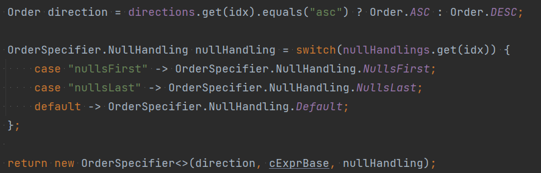

# 동적 Sorting, Paging 구현
## 목차
- [JPA](#jpa)
  - [Usage-JPA](#usage-jpa)
- [QueryDSL](#querydsl)
  - [동작 순서](#동작-순서)
    - [1. 테이블 명을 기준으로 property가 정의된 테이블과 엔티티 찾기](#1-테이블-명을-기준으로-property가-정의된-테이블과-엔티티-찾기)
    - [2. 엔티티 클래스로부터 property의 클래스 타입 찾기](#2-엔티티-클래스로부터-property의-클래스-타입-찾기)
    - [3. 엔티티와 property로부터 path qclassproperty를 구하기](#3-엔티티와-property로부터-path--qclassproperty--를-구하기)
    - [4. 집계함수 적용하기](#4-집계함수-적용하기)
    - [5. OrderSpecifier 객체 생성](#5-orderspecifier-객체-생성)
  - [Usage-QueryDSL](#usage-querydsl)
  - [TblCodec](#tblcodec)

# JPA
> OrderSpecs - Pageable 객체의 Sort 클래스를 활용

- 변수는 Sort 클래스와 마찬가지로 4개로 구성.
- 웹에서 읽어올 수 있도록 변환
```java
/**
 * 정렬 방향 (오름차순 asc, 내림차순 desc)
 */
protected List<String> directions;

/**
 * 정렬할 속성들이며 엔티티 필드명과 같음
 */
protected List<String> properties;

/**
 * 대소문자 구분
 */
protected List<Boolean> ignoreCases;

/**
 * null값 handling 결정
 * "native" (default) - db가 결정
 * "nullsFirst"
 * "nullsLast"
 */
protected List<String> nullHandlings;
```
- 각 속성을 리스트로 구분했으며 동일한 index의 속성끼리 모여 하나의 Order 객체를 만듦
- [OrderSpecs.java toOrders() 참고](OrderSpecs.java)

## Usage-JPA
### JSON parameter
```json
{
  "directions": [
    "asc",
    "desc"
  ],
  "properties": [
    "contestName",
    "participantDigit"
  ],
  "ignoreCases": [
    true,
    true
  ],
  "nullHandlings": [
    "native",
    "native"
  ]
}
```
### Controller
```java
@PostMapping("participant/pageAll/sorted")
@ResponseBody
public Page<ParticipantJpaDto> getSortedParticipants(@RequestBody OrderSpecs orderSpecs,
        Pageable pageable) throws Exception {
    pageable = PageRequest.of(pageable.getPageNumber(), pageable.getPageSize(),
        Sort.by(orderSpecs.toOrders()));
    return participantDtoService.getAll(pageable);
}
```
> JPA는 repository 메서드의 전달인자로 Pageable 객체를 전달하면 Sorting, Paging이 동작
> 
> 기존 메서드에 전달하는 Pageable 객체를 수정하는 것만으로 구현이 가능

# QueryDSL
> QsdlOrderSpecs - OrderSpecs 객체를 상속받아 사용

- 추가로 사용하는 변수들
```java
/**
 * 정렬 구현 가능한 집계함수 목록
 */
public static final String[] AGGREGATION_LIST = {"avg", "sum"};

/**
 * 정렬할 속성에 사용할 집계함수들
 */
private List<String> aggregations;

/**
 * 정렬할 속성이 정의된 테이블 이름, 암호화 구현 안함
 */
private List<String> tables;
```
- 마찬가지로 각 속성을 리스트로 구분했으며 순서도 동일해야 함
- 동일한 index 값끼리 모여 OrderSpecifier 객체를 생성하고 이를 이용해 정렬

## 동작 순서
### 1. 테이블 명을 기준으로 property가 정의된 테이블과 엔티티 찾기
```java
/**
 * <p>
 * 입력받은 QClass들과 매핑된 엔티티 클래스의 {@code @Table(name = tableName)} 어노테이션을 탐색
 * </p>
 * 어노테이션의 name값이 {@code tableName}과 같은 엔티티 클래스를 찾아 반환
 * @param rootPaths QCLass들
 * @param tableName 실제로 DB에 저장된 테이블의 암호화된 이름
 * @return 찾은 테이블로부터 만들어진 QCLass 타입 또는 null
 */
private BeanPath<?> findParent(List<BeanPath<?>> rootPaths,
                                String tableName);
```
### 2. 엔티티 클래스로부터 property의 클래스 타입 찾기
```java
/**
 * QClass로부터 Entity 클래스를 찾고 property 명을 통해 필드 변수와 그 타입을 검색
 * @param rootPath QClass
 * @param property 정렬할 속성명
 * @return 필드를 찾으면 그 타입을 반환하고 찾지 못하면 null을 반환
 */
private Class<?> propertyTypeFromEntity(Path<?> rootPath,
                                        String property);
```
### 3. 엔티티와 property로부터 Path(QClass.property)를 구하기
```java
/**
 * 일반 표현식
 */
private <T extends Comparable<?>> ComparableExpressionBase<T> comparableExpressionBase(Class<T> propertyType,
                                                                                       Path<?> parent,
                                                                                       String property) {
    return Expressions.comparablePath(propertyType, parent, property);
}

/**
 * 집계함수 사용을 위한 표현식
 */
private <T extends Number & Comparable<?>> NumberExpression<T> numberExpression(Class<T> propertyType,
                                                                                Path<?> parent,
                                                                                String property) {
    return Expressions.numberPath(propertyType, parent, property);
}
```
### 4. 집계함수 적용하기
```java
/**
 * {@code parent} 타입의 RootPath로부터
 * 속성명 {@code property}와 {@code propertyType}의 Path를 찾아 집계함수를 적용한 표현식으로 변환
 * @param propertyType 속성 타입
 * @param parent RootPath {@code QClass} 타입
 * @param property 정렬할 속성 명
 * @param aggr 집계함수 명
 * @return 집계함수가 적용된 표현식 반환
 * @param <T>
 */
@SuppressWarnings("unchecked")
private <T extends Number & Comparable<?>> ComparableExpressionBase<?> aggregate(Class<?> propertyType,
                                                                                 Path<?> parent,
                                                                                 String property,
                                                                                 String aggr);
    
```
### 5. OrderSpecifier 객체 생성

> cEsprBase는 comparableExpressionBase()의 반환값

## Usage-queryDSL
### JSON parameter
```json
{
  "directions": [
    "desc"
  ],
  "properties": [
    "participantDigit.age"
  ],
  "ignoreCases": [
    true
  ],
  "nullHandlings": [
    "native"
  ],
  "aggregations": [
    "avg"
  ],
  "tables": [
    "jpa_participant"
  ]
}
```
### Controller
```java
@PostMapping("avgAge/sorted")
@ResponseBody
public Page<ParticipantAvgAgeDto> getSortedAvgAge(@RequestBody QdslOrderSpecs qdslOrderSpecs,
                                                  Pageable pageable) throws Exception {
    return service.getParticipantAvgAge(pageable, qdslOrderSpecs);
}
```
### Service
```java
public Page<ParticipantAvgAgeDto> getParticipantAvgAge(Pageable pageable,
                                                       QdslOrderSpecs qdslOrderSpecs) throws Exception {
    QParticipant participant = QParticipant.participant;
    query.orderBy(qdslOrderSpecs.toOrders(participant))
        .limit(pageable.getPageSize())
        .offset(pageable.getPageOffset())
        .fetch();
}
```
## TblCodec
> table 명을 그대로 가져다 쓰지말고 decodeOne(), encodeOne() 메서드를 수정해서 사용

[말고 다른 방법으로 Sort하기](../qdslsort/README.md)


